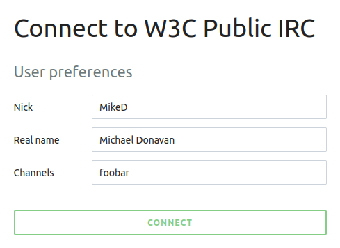

## W3C IRC web client

The easiest way to connect to W3C's IRC server, especially if you're in a hurry, is to point your browser at [https://webirc.w3.org](https://webirc.w3.org/). Just enter your desired nickname and channel, and you'll be talking in no time.

## W3C IRC server details

If you'd like to use [your own client](#where-can-i-find-a-client) to connect to our server, here are the details you need:

Address:

: [irc.w3.org](irc://irc.w3.org:6667)

Available ports (choose one):

: 6667, 6665, 194, 994 (TLS), 6679 (TLS)
: **W3C staff**: use port 6697; see the [W3C Team IRC documentation](/Systems/Irc/Guide).

Some firewalls block outbound traffic for the traditional IRC ports (6665 through 6669). If you have trouble connecting with one port, try another. If none of them work, [use our web client](#w3c-irc-web-client).

**Security note:** Remember that, just as with email, IRC is usually not encrypted. In addition, the W3C IRC servers do not have any access control. Be sure to check who's on your channel when you join and watch who joins during your meeting, particularly if what you're discussing is Member-confidential.

## Suggested channels

Channels are automatically created on demand so it is very easy to create new channels as we need them. Channels are joined in traditional IRC clients by using the command `/join #ChannelName`. Below are popular channels for W3C Team and collaborators:

[#chairs](irc://irc.w3.org/chairs)

: Close to the [chairs mailing list](https://lists.w3.org/Archives/Member/chairs/) in purpose

[#w3c](irc://irc.w3.org/w3c)

: For general talk and communication with W3C staff

[#sysreq](irc://irc.w3.org/sysreq)

: For W3C systems/tools discussion and urgent requests

## What is IRC?

IRC is a real-time chat system used around the world to aid in collaboration, support and socializing. IRC consists of two pieces, a [client](#w3c-irc-web-client) and a [server](#w3c-irc-server-details). Users launch their client, connect it to an IRC server and can begin chatting. There are two main ways to chat: one-to-one chatting via "private messages" and group chats, which take place in "channels". A good place to learn more about IRC is [irchelp.org](https://www.irchelp.org/), particularly [The IRC Prelude](https://www.irchelp.org/irchelp/new2irc.html), though this page should be enough to get people started using IRC at W3C.

## Why use IRC?

IRC is more immediate than email: it's almost like having a conversation. IRC is very useful when used in conjunction with a teleconference as it makes it easy to share information like URIs or code (be careful though, there is a [length limitation](#hints-and-workarounds)).

At W3C we use IRC during meetings in order to take and review minutes, share URLs, monitor the speaker queue, get systems support and even just socialize. IRC has become a core part of our workflow, and while it can be overwhelming at first, it quickly becomes indispensable. Taking notes on IRC during a phone call or conference, and then mailing the log to the participants (possibly after editing it), has proven to be a pretty effective collaboration technique.

At W3C there is often a channel running during meetings. A working group should choose a channel name (usually related to their name) and distribute it to their members. When it comes time for a teleconference, members connect to the IRC server and join that channel to participate.

In addition to all of the other benefits of using IRC, there are also a number of ['bots'](https://en.wikipedia.org/wiki/Internet_Relay_Chat_bot). These bots appear as people in the channel, but are actually automated tools. There are two important bots:

[Zakim](zakim)

: teleconference management

[RRSAgent](rrsagent.md)

: minute taking

None of the W3C bots will ever ask you for any of your personal information, password, or to authenticate with them. All the bots that are run by W3C can be recognized by the following mask:

> `name_of_bot@random_id.team_cloak`

Please [report](mailto:sysreq@w3.org) any suspicious bot.

## Where can I find a client?

You're welcome to always use [our web client](https://webirc.w3.org/), if you like it. However, dedicated client software often offers features that the web client doesn't yet, such as personalized notifications and automatic reconnection. Below are links for some popular client programs, by platform:

Windows

: [HexChat](https://hexchat.github.io/), [mIRC](https://www.mirc.co.uk/), [Quassel](https://quassel-irc.org/)

MacOS; iOS

: [Colloquy](https://colloquy.app/), [Textual](https://www.codeux.com/textual/), [irssi](https://irssi.org/), [Quassel](https://quassel-irc.org/), [Adium](https://adium.im/)

GNU/Linux

: [HexChat](https://hexchat.github.io/), [X-Chat](http://xchat.org/), [irssi](https://irssi.org/), [Quassel](https://quassel-irc.org/), [Konversation (KDE)](https://konversation.kde.org/), [Pidgin](https://pidgin.im/)

Android

: [yaaic](https://www.yaaic.org/)

Sailfish

: [Communi](https://openrepos.net/content/thaodan/communi)

If you'd like to explore other options, Wikipedia has a [list of IRC clients](https://en.wikipedia.org/wiki/Comparison_of_Internet_Relay_Chat_clients).

Note that due to abuse, the bridge between the [Matrix](https://matrix.org/ecosystem/bridges/) and our irc network was shutdown in April 2024.

## W3C IRC Conventions

Use a good nick

: Please use a nickname that is uniquely recognizable as you: your name, initials, or some variant.

Get a room!

: The #w3c channel is open to everybody so use it with consideration. If you have specific things to discuss then you can do one of the following:

: - If you are two people then use private messages with the `/msg OtherPerson your message here`
: - If you are more than two people then you can open a new channel by picking a name and then have each participant use the command `/join #YourChannel`.

Out of band or off the record comments

: W3C house style is to use "action" messages to denote out-of-band or off-the-record comments. Most IRC clients have a command called `/me` that generates this type of message. Clients generally display these messages in a different style from normal messages. For example, the irc command "/me waves" might result in the discussion window showing the text "* Ralph waves". The [RRSAgent](rrsagent.md) logging tool excludes these messages from the web log.

: When IRC is used to keep meeting minutes it is important to distinguish what was actually said in the meeting from side conversations that were not heard by all (i.e., on a teleconference). [Ralph](/staff/#rswick) encourages the use of square brackets around messages that are intended to be side comments for the log; e.g. "\[Ralph agrees]".

Join only channels to which you have been invited

: IRC channels can enforce a "by invitation only" policy, but life is easier for everyone if meeting chairs don't have to go through that hassle. Only enter channels that are public, or where you have a standing invitation.

Are you there?

: If you are away from your computer or otherwise unavailable, use the `/away` command to let others know.

Logging

: Let others know if you are logging their communications, and what you intend to do with them. If you are logging a channel, please let others know by announcing it in the channel topic using the `/topic` command.

TTACA

: Try to Avoid Cryptic Acronyms. The W3C community is very diverse, and not everyone will know what you are talking about.

## Hints and workarounds

If you have some experiences that you want to pass on then please add them to this list:

Line lengths and pasting

: The IRC protocol has a short (about 500 characters) limit on packet size, and messages can't span packets. This means that if you paste a long line, e.g., a whole paragraph with no line-feeds, it will look fine to you but to others it will appear truncated.

: Keep lines under 400 characters for safety.

: In addition, there is a limit on how *fast* you can paste or issue commands. The rate is about one command every two seconds, although you can have the first four commands without any delay; this means a paste of 25 lines will take about ten seconds to appear on other users' screens, and longer pastes can quickly get annoying. Also, pasted lines starting with `/` will usually be interpreted as IRC commands!

: To paste long fragments, use a [paste bin](http://www.pastebin.ca/) and then share the URI in IRC.

Timestamps in mIRC

: To add timestamps to your display of discussions in the [mIRC](https://www.mirc.co.uk/) client, use File → Options, go to the IRC section, Messages subsection, and check the "Timestamp events" box. The time that is displayed will be the local time from your machine; others might therefore not see the same timestamps that you see.

Making UTF-8 work in mIRC

: It seems that to enable input and cut and paste of utf-8 you need to click on the system icon (top left of the window), select Font… and set UTF-8 option to Display and encode, rather than Default.
